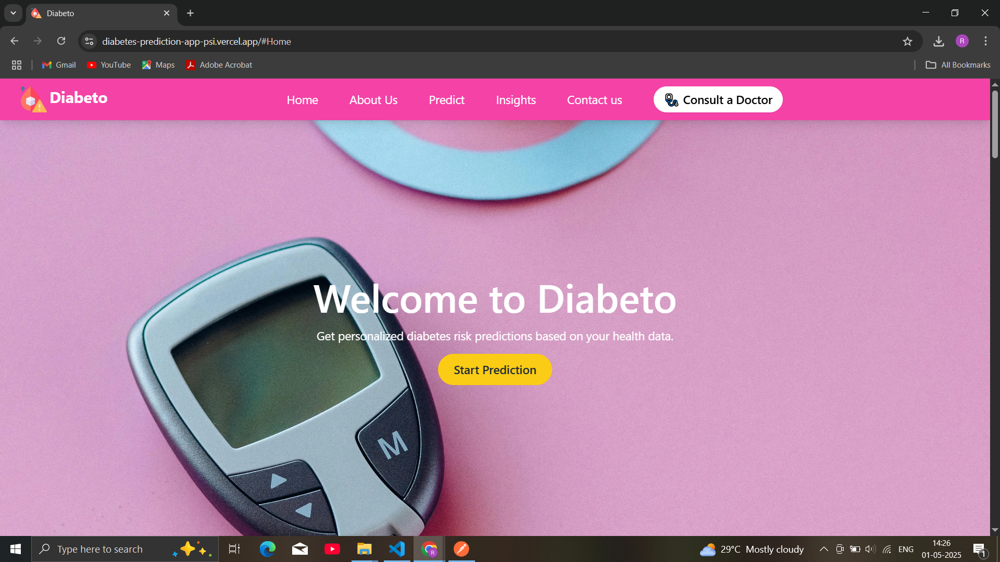
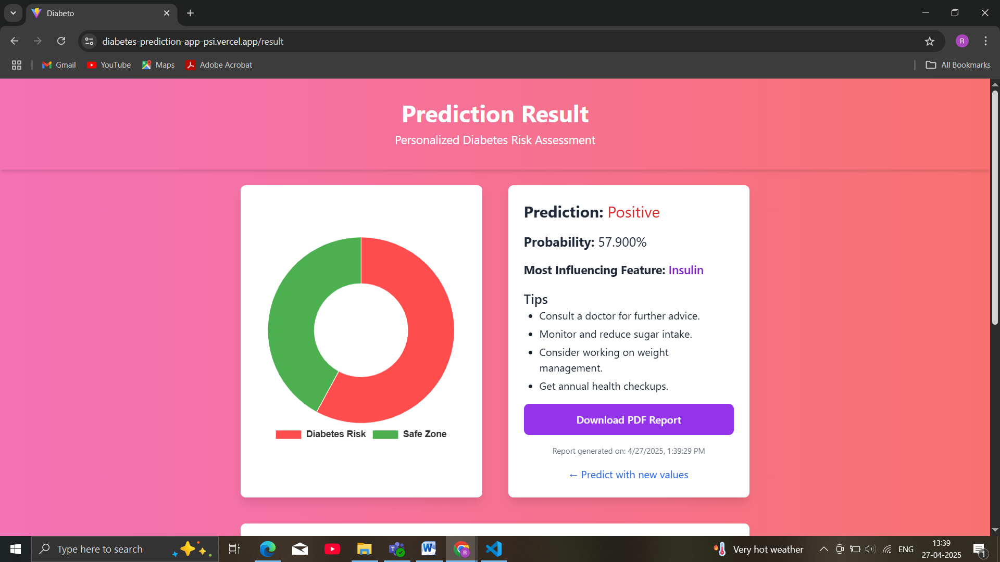

---

# 🩺 Diabetes Prediction Web App

A full-stack web application that predicts the likelihood of diabetes based on user inputs.  
It uses a Machine Learning model trained with Scikit-learn, a Django backend for API services and data storage, and a React.js frontend for user interaction and result visualization.

---

## ✨ Features

- 🧠 Machine Learning-based diabetes prediction
- 📊 Beautiful visualization of prediction probability (Doughnut Chart)
- 📈 Feature importance graph to show major health indicators
- 🗂️ User input data stored securely in PostgreSQL database
- 🧾 PDF report generation with detailed prediction results
- 🕒 Timestamped prediction records
- 💬 Personalized health tips based on prediction
- 🔗 "Consult a Doctor" link for nearby doctor suggestions

---

## 🛠️ Tech Stack

| Category              | Technologies |
|------------------------|--------------|
| **Frontend**           | React.js, Tailwind CSS, Bootstrap, Chart.js, Recharts |
| **Backend**            | Django, Django REST Framework |
| **Machine Learning**   | Scikit-learn |
| **Database**           | PostgreSQL (Render Hosting) |
| **Hosting**            | Vercel (Frontend) + Render (Backend) |
| **Tools & IDEs**       | Visual Studio Code |

---

## 🚀 How to Run the Project

### 1. Backend Setup (Django)

- Clone the repository:
  ```bash
  git clone https://github.com/riyahoro/diabetes-prediction-app.git
  ```
- Navigate to backend folder:
  ```bash
  cd backend
  ```
- Create a virtual environment and activate it:
  ```bash
  python -m venv venv
  source venv/bin/activate   # On Windows use: venv\Scripts\activate
  ```
- Install dependencies:
  ```bash
  pip install -r requirements.txt
  ```
- Set up the PostgreSQL database (update `settings.py` with your database URL).
- Run migrations:
  ```bash
  python manage.py migrate
  ```
- Start the server:
  ```bash
  python manage.py runserver
  ```

### 2. Frontend Setup (React.js)

- Navigate to frontend folder:
  ```bash
  cd frontend
  ```
- Install dependencies:
  ```bash
  npm install
  ```
- Start the React development server:
  ```bash
  npm start
  ```

---

## 📄 Project Structure

```
Diabetes_prediction/
├── backend/
│   ├── manage.py
│   ├── backend app files (models.py, views.py, urls.py, etc.)
│
├── frontend/
│   ├── src/
│   │   ├── assets/               # Static assets like images, fonts, etc.
│   │   ├── App.jsx               # Main React component
│   │   └── other .jsx files      # Additional React components
│   ├── public/
│   └── package.json
│
├── venv/                         # Virtual environment for backend
│
├── Procfile                      # For deployment (Render)
├── requirements.txt              # Backend dependencies
├── README.md                     # Project documentation (this file)
```

---


## 📸 Screenshots

| Home Page                               | Prediction Result Page                | Feature Importance Chart            |
|:---------------------------------------:|:-------------------------------------:|:-----------------------------------:|
|   |  |  |


---

## 🙌 Acknowledgements

- [Scikit-learn](https://scikit-learn.org/)
- [Django](https://www.djangoproject.com/)
- [React.js](https://reactjs.org/)
- [Render](https://render.com/)
- [Vercel](https://vercel.com/)

---

## 📬 Contact

If you have any questions or suggestions, feel free to reach out!  
**Email:** riyahoro74@gmail.com  
**LinkedIn:**(https://www.linkedin.com/in/riya-horo-6121ba252/)

---

# 🚑 Live Demo

👉 [View Deployed Website](https://diabetes-prediction-app-psi.vercel.app/)  
👉 [Backend API](https://diabetes-prediction-app-dm26.onrender.com)

---

